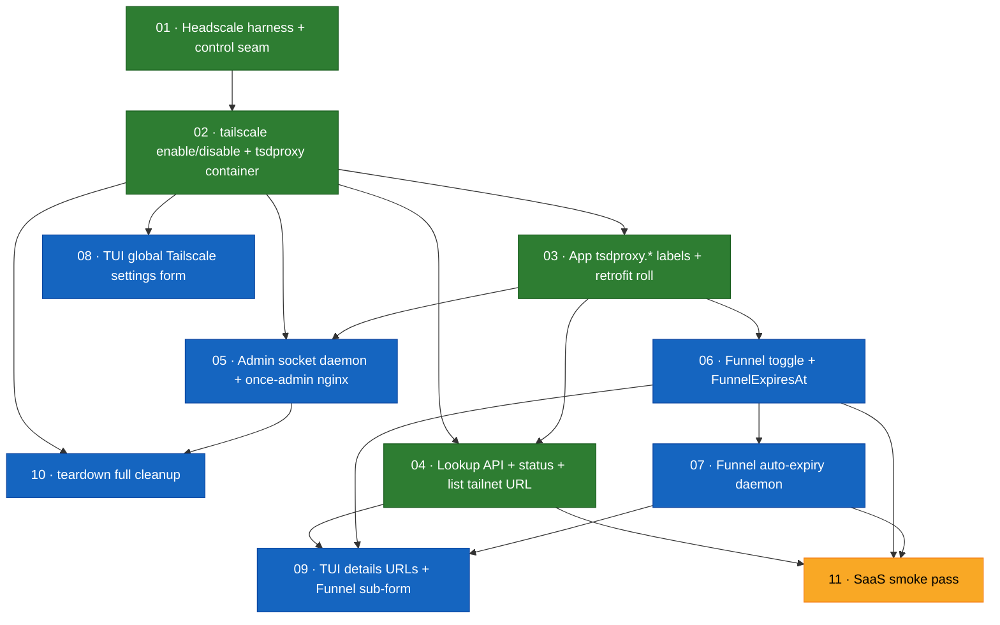

# Tailscale Integration — Issue Dependency Graph

Arrows point from a blocker to the issue it unblocks (`A --> B` = B is blocked by A).
Generated from the `## Blocked by` section of each issue.

## Legend

| Color | Status |
|-------|--------|
| 🟩 Green | `done` |
| 🟦 Blue | `ready-for-agent` |
| 🟨 Yellow | `needs-info` |

## Status snapshot

| # | Issue | Status | Blocked by |
|---|-------|--------|-----------|
| 01 | Headscale harness + control seam | done | — |
| 02 | `once tailscale enable/disable` + tsdproxy container | done | 01 |
| 03 | App `tsdproxy.*` labels + retrofit roll | done | 02 |
| 04 | Lookup API + `status` + `list` tailnet URL | done | 02, 03 |
| 05 | Admin socket daemon + `once-admin` nginx | ready-for-agent | 02, 03 |
| 06 | Funnel toggle + `FunnelExpiresAt` | ready-for-agent | 03 |
| 07 | Funnel auto-expiry daemon | ready-for-agent | 06 |
| 08 | TUI global Tailscale settings form | ready-for-agent | 02 |
| 09 | TUI details URLs + Funnel sub-form | ready-for-agent | 04, 06, 07 |
| 10 | `once teardown` full cleanup | ready-for-agent | 02, 05 |
| 11 | SaaS smoke pass | needs-info | 04, 06, 07 |
| 14 | Validate OAuth credentials before enabling | needs-triage | — |
| 15 | Fetch tailnet domain suffix on enable | needs-triage | 14 |
| 16 | Headscale control server enable (model + CLI) | needs-triage | — |
| 17 | TUI Headscale control server fields | needs-triage | 16 |
