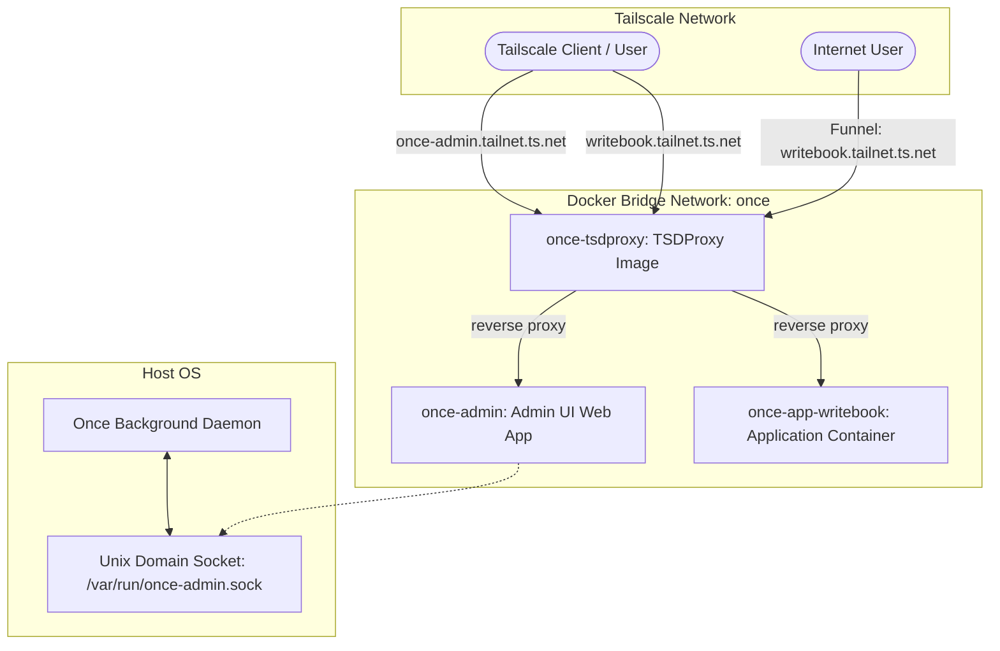

# Goal
Enable Once apps to be available using Tailscale with Magic DNS based discovery so they can be accessed securely from any device in the tailnet.

## Constraints
- **Tailscale Magic DNS Discovery**: Every app gets a unique DNS name in the tailnet and can be accessed using that name.
- **No Sidecar Container per App**: Use a single `once-tsdproxy` container instead of creating companion Tailscale containers for each application.
- **No Public/Host Ports**: Keep the admin interface completely private to the tailnet with zero open host TCP ports.
- **Funnel Support**: Allow temporary public access to the application endpoints via Tailscale Funnel.

## Architecture

### Components

1. **`once-tsdproxy` Container**:
   - Runs `almeidapaulopt/tsdproxy:2` pre-built image.
   - Connected to the `once` bridge network.
   - Mounted to `/var/run/docker.sock` to monitor containers and `/data` volume for state persistence.
   - Configured with Tailscale OAuth Client Credentials.
   
2. **`once-admin` Container**:
   - Runs the official `nginx:alpine` image.
   - Connected to the `once` bridge network with no host ports published.
   - Mounts the host's `/var/run/once-admin.sock` and a generated `nginx.conf` file to route traffic to the socket.
   - Labeled for TSDProxy exposure:
     - `tsdproxy.enable=true`
     - `tsdproxy.name=once-admin`
     
3. **Application Containers**:
   - Exposed by adding TSDProxy labels during creation:
     - `tsdproxy.enable=true`
     - `tsdproxy.name={appName}`
     - `tsdproxy.port.1=443/https:80/http`
   - To enable Funnel:
     - Update port label to `443/https:80/http, tailscale_funnel`.

---

## Proposed Changes

### Configuration & Settings
- Add Tailscale OAuth Client ID and Client Secret settings to Once.
- Store these settings in the proxy container's label or internal state.

### CLI / Daemon Updates
- Update the daemon to listen on `/var/run/once-admin.sock` and serve the admin backend API.
- Add code to boot and teardown the `once-tsdproxy` and `once-admin` system containers when Tailscale is enabled/disabled.
- Configure `once-tsdproxy` container using environment variables:
  - `TSDPROXY_TAILSCALE_DEFAULT_CLIENTID`
  - `TSDPROXY_TAILSCALE_DEFAULT_CLIENTSECRET`
  - `TSDPROXY_DOCKER_HOST=unix:///var/run/docker.sock`
- Retrieve registered FQDNs for the admin panel and application nodes by querying `http://once-tsdproxy:8080/api/v1/proxies` from the host daemon.

### Deployment Updates
- Attach `tsdproxy.*` labels to application containers dynamically when Tailscale is configured.
